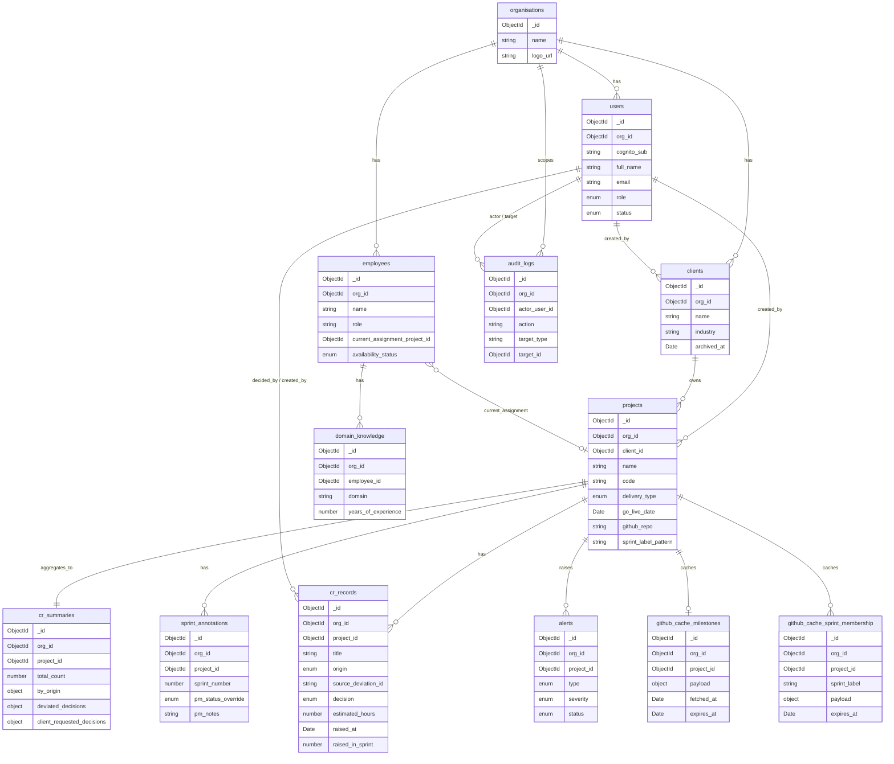

# Data Model — Trackwise

**Last Updated:** 2026-05-08
**Status:** Approved
**Version:** v1.1

---

## Purpose

This document is the **canonical data dictionary** for Trackwise. It is the single human-readable reference for collection structures, field definitions, indexes, and relationships. Every backend engineer should be able to answer "what does field X mean?" or "what indexes does collection Y have?" from this page alone.

When the schema changes, **this document is updated in the same pull request** — schema and dictionary do not drift.

For *why* a structure looks the way it does, see the ADR linked at the top of each section. This document focuses on *what* is stored, not *why*.

---

## Architectural anchor

- **Database:** MongoDB Atlas (M0 free tier at v1.0)
- **ODM:** Mongoose via `@nestjs/mongoose`
- **Multi-tenancy:** every document carries `org_id`; every query filtered at the NestJS service layer ([ADR-002](../decisions/architect/ADR-002-database-and-data-layer.md))
- **Field naming:** snake_case end-to-end (storage, API, codebase)
- **Frontend access rule:** UI reads only Trackwise APIs; backend may call GitHub server-side with a 60s cache ([ADR-008](../decisions/architect/ADR-008-data-ownership-and-sync.md))

---

## ADR map

| ADR | Scope |
|-----|-------|
| [ADR-002](../decisions/architect/ADR-002-database-and-data-layer.md) | Database choice, multi-tenancy model, base collection list, indexing strategy |
| [ADR-008](../decisions/architect/ADR-008-data-ownership-and-sync.md) | Data ownership rule (Trackwise-owned vs GitHub-mirrored), cache vs sync decision |
| [ADR-009](../decisions/architect/ADR-009-data-model-core-entities.md) | Detailed schema for core entities (organisations, users, clients, projects, employees, domain_knowledge, audit_logs) |
| [ADR-010](../decisions/architect/ADR-010-data-model-project-operations.md) | Detailed schema for operational entities (cr_records, cr_summaries, sprint_annotations, alerts) |
| [ADR-011](../decisions/architect/ADR-011-github-mirror-cache.md) | GitHub cache collection design and TTL behaviour |
| [ADR-012](../decisions/architect/ADR-012-seeding-strategy.md) | Bootstrap seed data and TTL/unique index creation |

---

## Entity-relationship diagram

> **Note on parked entities:** `qa_reports` and `deviations` are PM-parked (Session 8). They will be added in a future ADR-013 when PM defines structure or provides an existing DB. The diagram and tables below do not include them.

---

## Collection reference

For each collection: fields, types, required, indexes, owning ADR. The detailed rationale lives in the owning ADR.

### organisations

The Trackwise tenant. One per Cognito `custom:org_id`.
**Owning ADR:** [ADR-009](../decisions/architect/ADR-009-data-model-core-entities.md#schema--organisations)

| Field | Type | Required | Notes |
|-------|------|----------|-------|
| `_id` | ObjectId | Yes | Tenant identifier |
| `name` | String | Yes | Display name |
| `logo_url` | String | No | CDN-hosted logo |
| `created_at` | Date | Yes | Mongoose timestamp |
| `updated_at` | Date | Yes | Mongoose timestamp |

**Indexes:** `_id` (default).

**Removed (ADR-008 amendment):** `github_sync_interval_minutes` — no scheduled sync; cache TTL is fixed.

---

### users

Application users. Each row mirrors a Cognito user with Trackwise-side metadata.
**Owning ADR:** [ADR-009](../decisions/architect/ADR-009-data-model-core-entities.md#schema--users)

| Field | Type | Required | Notes |
|-------|------|----------|-------|
| `_id` | ObjectId | Yes | |
| `org_id` | ObjectId | Yes | Tenant scope |
| `cognito_sub` | String | Yes | Cognito subject — JWT lookup key |
| `full_name` | String | Yes | (ST-050) |
| `email` | String | Yes | RFC 5322; lowercase normalised |
| `role` | Enum | Yes | `cto_ceo` \| `pm` (organisational label only) |
| `status` | Enum | Yes | `active` \| `disabled` (ST-053) |
| `last_signed_in_at` | Date | No | Updated on successful login |
| `created_by_user_id` | ObjectId | No | Manager who created this user |
| `created_at` | Date | Yes | |
| `updated_at` | Date | Yes | |

**Indexes:**
- `org_id + email` (unique)
- `cognito_sub` (unique)
- `org_id + status`

---

### clients

**Owning ADR:** [ADR-009](../decisions/architect/ADR-009-data-model-core-entities.md#schema--clients)

| Field | Type | Required | Notes |
|-------|------|----------|-------|
| `_id` | ObjectId | Yes | |
| `org_id` | ObjectId | Yes | |
| `name` | String | Yes | |
| `industry` | String | No | Free-text |
| `archived_at` | Date | No | Set by ST-056 |
| `created_by_user_id` | ObjectId | Yes | |
| `created_at` | Date | Yes | |
| `updated_at` | Date | Yes | |

**Indexes:**
- `org_id + _id`
- `org_id + archived_at`

---

### projects

**Owning ADR:** [ADR-009](../decisions/architect/ADR-009-data-model-core-entities.md#schema--projects)

| Field | Type | Required | Notes |
|-------|------|----------|-------|
| `_id` | ObjectId | Yes | |
| `org_id` | ObjectId | Yes | |
| `client_id` | ObjectId | Yes | FK → `clients._id` |
| `name` | String | Yes | |
| `code` | String | Yes | Short identifier |
| `delivery_type` | Enum | Yes | `fixed_scope` \| `fixed_budget` |
| `go_live_date` | Date | No | |
| `github_repo` | String | No | `org/repo` |
| `github_org` | String | No | |
| `github_oauth_token_encrypted` | String | No | AES-encrypted OAuth token |
| `sprint_label_pattern` | String | Yes | Default `sprint-N` (PRD §12.1) |
| `archived_at` | Date | No | |
| `created_by_user_id` | ObjectId | Yes | |
| `created_at` | Date | Yes | |
| `updated_at` | Date | Yes | |

**Indexes:**
- `org_id + client_id`
- `org_id + _id`
- `org_id + archived_at`

**Removed (ADR-008/004 amendments):** `cr_tracker_path`, `last_synced_at`, `last_sync_status`.
**Renamed:** `github_sprint_label_prefix` → `sprint_label_pattern`.
**Not stored:** `current_sprint_number` — derived from sprint label cache (highest `N` with open work items).

---

### employees

**Owning ADR:** [ADR-009](../decisions/architect/ADR-009-data-model-core-entities.md#schema--employees)

| Field | Type | Required | Notes |
|-------|------|----------|-------|
| `_id` | ObjectId | Yes | |
| `org_id` | ObjectId | Yes | |
| `name` | String | Yes | |
| `role` | String | Yes | Free-text job title |
| `current_assignment_project_id` | ObjectId | No | FK → `projects._id` |
| `availability_status` | Enum | Yes | `available` \| `assigned` \| `partially_available` \| `on_leave` |
| `created_by_user_id` | ObjectId | Yes | |
| `created_at` | Date | Yes | |
| `updated_at` | Date | Yes | |

**Indexes:**
- `org_id + current_assignment_project_id`
- `org_id + availability_status`

**Notes:** Employees have no Cognito account. PM-managed only.

---

### domain_knowledge

**Owning ADR:** [ADR-009](../decisions/architect/ADR-009-data-model-core-entities.md#schema--domain_knowledge)

| Field | Type | Required | Notes |
|-------|------|----------|-------|
| `_id` | ObjectId | Yes | |
| `org_id` | ObjectId | Yes | |
| `employee_id` | ObjectId | Yes | FK → `employees._id` |
| `domain` | String | Yes | Free-text, lowercase normalised |
| `years_of_experience` | Number | No | Integer ≥ 0 |
| `notes` | String | No | Max 500 chars |
| `created_at` | Date | Yes | |
| `updated_at` | Date | Yes | |

**Indexes:**
- `org_id + employee_id`
- `org_id + domain`

---

### audit_logs

Append-only log of admin actions (per ADR-003 amendment).
**Owning ADR:** [ADR-009](../decisions/architect/ADR-009-data-model-core-entities.md#schema--audit_logs)

| Field | Type | Required | Notes |
|-------|------|----------|-------|
| `_id` | ObjectId | Yes | |
| `org_id` | ObjectId | Yes | |
| `actor_user_id` | ObjectId | Yes | Who performed the action |
| `action` | String | Yes | Dotted path (`user.create`, `client.archive`, etc.) |
| `target_type` | String | Yes | Entity type |
| `target_id` | ObjectId | Yes | Affected entity |
| `before` | Object | No | State snapshot before |
| `after` | Object | No | State snapshot after |
| `ip_address` | String | No | |
| `user_agent` | String | No | |
| `created_at` | Date | Yes | Indexed; primary sort field |

**Indexes:**
- `org_id + target_type + target_id + created_at`
- `org_id + actor_user_id + created_at`
- `org_id + action + created_at`

**Append-only by convention.** No service or endpoint mutates rows post-creation.

---

### cr_records

Individual CR rows. Source of truth for CR data.
**Owning ADR:** [ADR-010](../decisions/architect/ADR-010-data-model-project-operations.md#decision--cr_records)

| Field | Type | Required | Notes |
|-------|------|----------|-------|
| `_id` | ObjectId | Yes | |
| `org_id` | ObjectId | Yes | |
| `project_id` | ObjectId | Yes | FK → `projects._id` |
| `title` | String | Yes | |
| `description` | String | No | Max 5000 chars |
| `origin` | Enum | Yes | `deviation` \| `client_request` \| `internal` \| `regulatory` |
| `source_deviation_id` | String | No | Soft reference; null when `origin ≠ deviation` |
| `decision` | Enum | Yes | See decision table below |
| `estimated_hours` | Number | No | ≥ 0 |
| `actual_hours` | Number | No | ≥ 0 |
| `raised_at` | Date | Yes | |
| `raised_in_sprint` | Number | No | Sprint number active at `raised_at` |
| `decided_at` | Date | No | |
| `decided_in_sprint` | Number | No | |
| `decided_by_user_id` | ObjectId | No | FK → `users._id` |
| `delivered_at` | Date | No | (`origin=client_request`, `decision=delivered` only) |
| `delivered_in_sprint` | Number | No | |
| `requested_by` | String | No | (`origin=client_request` only) Client stakeholder name |
| `created_by_user_id` | ObjectId | Yes | |
| `created_at` | Date | Yes | |
| `updated_at` | Date | Yes | |

**Decision values by origin (service-layer validated):**

| `origin` | Valid `decision` values |
|----------|------------------------|
| `deviation` | `pending` \| `absorbed` \| `converted` \| `removed` |
| `client_request` | `pending` \| `approved` \| `rejected` \| `delivered` |
| `internal` | `pending` \| `accepted` \| `rejected` \| `completed` |
| `regulatory` | `pending` \| `mandatory` \| `completed` |

**Indexes:**
- `org_id + project_id + origin`
- `org_id + project_id + decision`
- `org_id + project_id + raised_in_sprint`
- `org_id + project_id + raised_at`

---

### cr_summaries

Pre-aggregated read model derived from `cr_records`. One row per project.
**Owning ADR:** [ADR-010](../decisions/architect/ADR-010-data-model-project-operations.md#decision--cr_summaries-semantic-shift)

| Field | Type | Required | Notes |
|-------|------|----------|-------|
| `_id` | ObjectId | Yes | |
| `org_id` | ObjectId | Yes | |
| `project_id` | ObjectId | Yes | |
| `total_count` | Number | Yes | All CRs |
| `by_origin` | Object | Yes | `{ deviation, client_request, internal, regulatory }` (counts) |
| `deviated_decisions` | Object | Yes | Per-decision `{ count, hours }` |
| `client_requested_decisions` | Object | Yes | Per-decision `{ count, hours }` |
| `internal_decisions` | Object | Yes | Per-decision `{ count, hours }` |
| `regulatory_decisions` | Object | Yes | Per-decision `{ count, hours }` |
| `last_recomputed_at` | Date | Yes | |
| `created_at` | Date | Yes | |
| `updated_at` | Date | Yes | |

**Indexes:**
- `org_id + project_id` (unique)

**Removed:** `sync_status`, `last_synced_at` (ADR-008 amendment).

**Recomputation:** triggered on every `cr_records` write/delete in the same service operation.

---

### sprint_annotations

PM-set overlays on top of GitHub-derived sprint state.
**Owning ADR:** [ADR-010](../decisions/architect/ADR-010-data-model-project-operations.md#decision--sprint_annotations)

| Field | Type | Required | Notes |
|-------|------|----------|-------|
| `_id` | ObjectId | Yes | |
| `org_id` | ObjectId | Yes | |
| `project_id` | ObjectId | Yes | |
| `sprint_number` | Number | Yes | Matches `sprint-N` suffix |
| `pm_status_override` | Enum | No | `on_track` \| `at_risk` \| `behind` |
| `pm_notes` | String | No | Max 2000 chars |
| `key_events` | Array<String> | No | |
| `created_by_user_id` | ObjectId | Yes | |
| `created_at` | Date | Yes | |
| `updated_at` | Date | Yes | |

**Indexes:**
- `org_id + project_id + sprint_number` (unique)

---

### alerts

In-app notifications generated by triggers.
**Owning ADR:** [ADR-010](../decisions/architect/ADR-010-data-model-project-operations.md#decision--alerts)

| Field | Type | Required | Notes |
|-------|------|----------|-------|
| `_id` | ObjectId | Yes | |
| `org_id` | ObjectId | Yes | |
| `project_id` | ObjectId | Yes | |
| `type` | Enum | Yes | `milestone_at_risk` \| `milestone_behind` \| `sprint_blocked_threshold` \| `cr_pending_overdue` \| `domain_mismatch` |
| `trigger_payload` | Object | No | Snapshot of triggering data |
| `severity` | Enum | Yes | `info` \| `warning` \| `critical` |
| `status` | Enum | Yes | `unread` \| `read` \| `dismissed` |
| `recipients` | Array<ObjectId> | Yes | FK → `users._id` |
| `read_by` | Array<{ user_id, read_at }> | No | Per-user read state |
| `dismissed_at` | Date | No | |
| `created_at` | Date | Yes | |

**Indexes:**
- `org_id + project_id + status`
- `org_id + recipients + status` (multikey)
- `org_id + type + created_at`

---

### github_cache_milestones

Server-side cache of GitHub milestone data per project.
**Owning ADR:** [ADR-011](../decisions/architect/ADR-011-github-mirror-cache.md#schema--github_cache_milestones)

| Field | Type | Required | Notes |
|-------|------|----------|-------|
| `_id` | ObjectId | Yes | |
| `org_id` | ObjectId | Yes | |
| `project_id` | ObjectId | Yes | |
| `payload` | Object | Yes | Processed milestone array |
| `fetched_at` | Date | Yes | |
| `expires_at` | Date | Yes | `fetched_at + 60s`; TTL-indexed |
| `source_etag` | String | No | GitHub `ETag` for revalidation |
| `source_status` | Enum | Yes | `ok` \| `partial` \| `stale_serving` |
| `source_error` | String | No | |

**Indexes:**
- `org_id + project_id` (unique)
- `expires_at` with `expireAfterSeconds: 0` (TTL — auto-purge)

---

### github_cache_sprint_membership

Server-side cache of GitHub issues per `(project, sprint label)` pair.
**Owning ADR:** [ADR-011](../decisions/architect/ADR-011-github-mirror-cache.md#schema--github_cache_sprint_membership)

| Field | Type | Required | Notes |
|-------|------|----------|-------|
| `_id` | ObjectId | Yes | |
| `org_id` | ObjectId | Yes | |
| `project_id` | ObjectId | Yes | |
| `sprint_label` | String | Yes | E.g. `sprint-5` |
| `payload` | Object | Yes | Issue array + derived counts (committed, completed, blocked, carryover, fresh) |
| `fetched_at` | Date | Yes | |
| `expires_at` | Date | Yes | TTL-indexed |
| `source_etag` | String | No | |
| `source_status` | Enum | Yes | |
| `source_error` | String | No | |

**Indexes:**
- `org_id + project_id + sprint_label` (unique)
- `expires_at` with `expireAfterSeconds: 0` (TTL)

---

## Field type conventions

| Convention | Applied to |
|------------|-----------|
| `_id` is always ObjectId | All collections |
| `org_id` is always ObjectId, always required, always indexed | All collections |
| FK fields (`*_id`) are ObjectId, except `source_deviation_id` (String, soft reference) | `cr_records.source_deviation_id` is the only exception |
| Timestamps stored as ISO Date in UTC | All `_at` fields |
| Enums declared as TypeScript string-literal unions in code | Mongoose `enum: [...]` in schema |
| Free-text fields lowercase + trim normalised at write | `email`, `domain` |
| `created_at`, `updated_at` set automatically via Mongoose `timestamps: true` | All collections in this dictionary |
| Dollar amounts | **Not stored anywhere in v1.0** — hours-only per PM Session 8 decision |

---

## Tenant isolation contract

Every NestJS service method:
1. Receives `org_id` from the request context (injected by `JwtAuthGuard`).
2. Includes `org_id` in **every** Mongo query as a filter.
3. Includes `org_id` in **every** Mongo write as a value.

There are no exceptions. The leading `org_id` field on every compound index is the database-level enforcement that any leaked query without `org_id` will degrade catastrophically (full collection scan), making the bug obvious in monitoring before it leaks data.

---

## Parked entities (out of v1.0)

| Entity | Owner | Status |
|--------|-------|--------|
| `qa_reports` | PM (parked Session 8) | No schema; dashboard QA section stubs `data_available: false` |
| `deviations` | PM (parked Session 8) | No schema; `cr_records.source_deviation_id` is a soft string reference until the entity ships |

When PM defines structure (or provides existing DB), a future ADR-013 will cover both entities and this dictionary will be updated.

---

## Change log

| Version | Date | Change |
|---------|------|--------|
| v1.0 | 2026-05-06 | Initial draft based on ADR-002 |
| v1.1 | 2026-05-08 | Full rewrite as canonical data dictionary. Added users, audit_logs, cr_records, sprint_annotations, github_cache_milestones, github_cache_sprint_membership. Schema cleanups per ADR-008. New fields per EP-09 / ST-058. Mermaid ER diagram added. ADR map and field-type conventions added |
